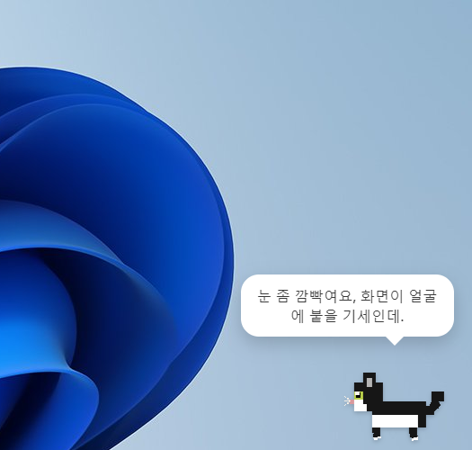
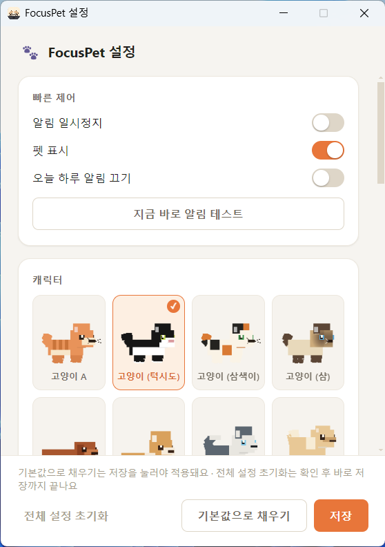

<div align="center">

# 🐾 FocusPet

작업하거나 공부할 때 화면 한쪽에 앉아있다가, 정해둔 방식으로 집중하라고 알려주는 Windows/macOS 데스크탑 펫

[](https://github.com/yoobilee/focus-pet/releases/latest)
[](LICENSE)
[](https://github.com/yoobilee/focus-pet/releases/latest)
[](#)
[](https://yoobilee.github.io/focus-pet/)



</div>

다른 프로그램을 아무리 켜놔도 — 전체화면 강의 영상 위에도 — 항상 화면 위에 떠 있어요. 실시간 3D로 렌더링되는 캐릭터가 커서를 졸졸 따라 쳐다보고, 손으로 집어 옮길 수도 있고, 정해둔 방식대로 "집중하세요"라고 알려줍니다.

## 특징

- **10종 캐릭터** — 고양이 4종(태비 · 턱시도 · 삼색이 · 샴), 강아지 4종(닥스훈트 · 코기 · 허스키 · 포메라니안), 토끼, 햄스터 중 선택
- **실시간 3D 렌더링** — 정지 이미지가 아니라 각진 복셀(voxel) 스타일 3D 모델이 회전하며 그루밍 · 앉기 · 낮잠 같은 종별 행동을 재생
- **커서 반응형 상호작용** — 화면 어디에 마우스가 있든 고개를 돌려 쳐다보고, 가까이 다가가면 귀를 쫑긋 세우는 등 종마다 다르게 반응
- **알림 트리거 방식 선택** — 정해진 시간마다 알려주는 고정 간격, 키보드 · 마우스 입력이 끊기면 알려주는 활동 감지 중 상황에 맞게 설정
- **언제나 최상단 표시** — 전체화면 강의 영상을 틀어놔도 항상 화면 위에 떠 있어서 가려지지 않음
- **손으로 집어 옮기기** — 드래그 이동, 화면 가장자리 자석 스냅, 좌우로 왕복하는 페이싱 모드
- **말풍선 알림 + 효과음** — 스누즈(10분 뒤 다시), 오늘 하루만 알림 끄기
- **세세한 커스터마이징** — 캐릭터 · 알림 방식/간격 · 소리 볼륨 · 이동 방식 · Windows 시작 시 자동 실행까지 설정 창 하나에서



더 자세한 소개와 스크린샷은 [웹사이트](https://yoobilee.github.io/focus-pet/)에서도 확인할 수 있어요.

## 다운로드

[**GitHub Releases에서 최신 버전 받기**](https://github.com/yoobilee/focus-pet/releases/latest) — Windows(`.exe`)와 Mac(`.dmg`) 모두 무료로 제공됩니다.

- **Windows**: 설치 파일을 실행하면 "Windows가 PC를 보호했습니다"라는 SmartScreen 경고가 뜰 수 있어요(서명 인증서 없이 배포되는 앱이라 나오는 정상적인 경고입니다) — **추가 정보** → **실행**을 누르면 설치됩니다.
- **macOS**: 애플 개발자 서명 없이 빌드돼서, 처음 열 때 "손상되었기 때문에 열 수 없습니다"라는 경고가 뜰 수 있어요. 터미널에서 아래 명령을 한 번 실행하면 해결됩니다.

  ```bash
  xattr -cr /Applications/FocusPet.app
  ```

## 로컬에서 실행하기

```bash
git clone https://github.com/yoobilee/focus-pet.git
cd focus-pet
npm install
npm start
```

설치 파일을 직접 만들고 싶다면 `npm run build`(지금 빌드를 돌리는 OS용으로 `dist/`에 생성)를 쓰세요. 버전 태그(`git tag vX.Y.Z && git push origin vX.Y.Z`)를 push하면 GitHub Actions가 Windows/Mac 빌드를 자동으로 만들어 Releases에 draft로 올려줍니다.

## 라이선스

[MIT](LICENSE) © YooBi Lee
